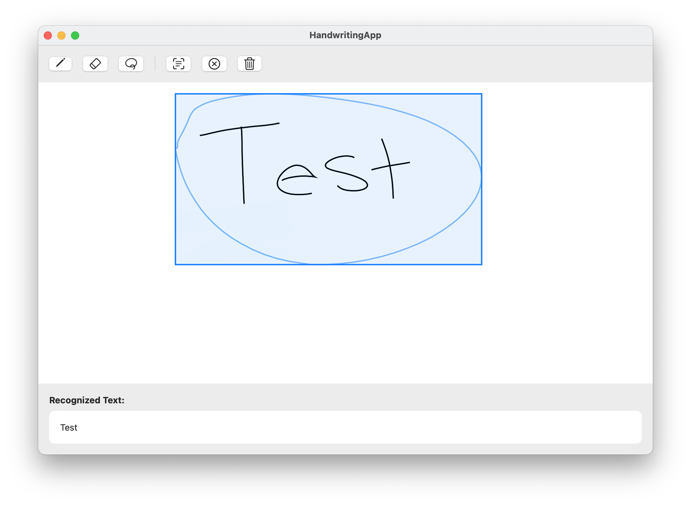

# HandwritingApp

A native macOS SwiftUI application that provides real-time handwriting recognition using Apple's Vision framework. This app enables instant conversion of handwritten text to digital format through an intuitive drawing interface, leveraging the power of Vision's built-in text recognition capabilities.



## Features

- **Drawing Tools**
  - Pressure-sensitive pencil tool for natural handwriting
  - Eraser tool for making corrections
  - Lasso tool for selecting text areas

- **Text Recognition**
  - Native Vision framework powered handwriting recognition
  - Support for English text
  - Real-time processing
  - Clear error handling with recovery suggestions

- **User Interface**
  - Clean, intuitive toolbar
  - Live drawing preview
  - Visual feedback for selection
  - Accessibility support
  - Error messaging system

## Requirements

- macOS 13.0 or later
- Xcode 15.0 or later
- Swift 5.9 or later

## Installation

1. Clone the repository:
```bash
git clone https://github.com/yourusername/HandwritingApp.git
cd HandwritingApp
```

2. Build and run the project:
```bash
swift run
```

## Usage

1. **Drawing**
   - Select the pencil tool from the toolbar
   - Draw on the canvas using your mouse or trackpad
   - Pressure sensitivity is supported with compatible hardware

2. **Erasing**
   - Select the eraser tool
   - Click and drag over areas you want to erase

3. **Text Recognition**
   - Select the lasso tool
   - Draw around the text you want to recognize
   - Click the "Recognize Text" button (viewfinder icon)
   - View the recognized text in the results panel

4. **Managing Content**
   - Use the clear selection button (X icon) to remove the current selection
   - Use the clear canvas button (trash icon) to start over

## Architecture

The app follows the MVVM (Model-View-ViewModel) architecture pattern:

- **Models**
  - `DrawingTool`: Represents available drawing tools
  - `DrawingPoint`: Represents a point in the drawing
  - `DrawingLine`: Represents a line in the drawing
  - `LassoSelection`: Handles selection functionality
  - `HandwritingError`: Custom error types

- **Views**
  - `ContentView`: Main container view
  - `DrawingCanvasView`: Handles drawing and selection rendering

- **ViewModels**
  - `DrawingViewModel`: Manages drawing state and business logic

- **Services**
  - `TextRecognitionService`: Handles Vision framework text recognition

## Testing

The app includes comprehensive unit tests and integration tests:

```bash
swift test
```

Tests cover:
- Drawing functionality
- Tool selection
- Error handling
- Text recognition
- Performance benchmarks

## Error Handling

The app provides clear error messages and recovery suggestions for common issues:
- Image processing errors
- Text recognition failures
- Invalid selections

## Accessibility

The app supports:
- VoiceOver navigation
- Keyboard shortcuts
- High contrast visuals
- Clear accessibility labels and hints

## Contributing

1. Fork the repository
2. Create your feature branch (`git checkout -b feature/AmazingFeature`)
3. Commit your changes (`git commit -m 'Add some AmazingFeature'`)
4. Push to the branch (`git push origin feature/AmazingFeature`)
5. Open a Pull Request

## License

This project is licensed under the MIT License - see the [LICENSE](LICENSE) file for details.
